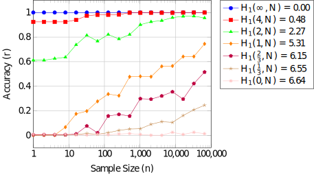

### Keywords {-}
Encrypted Search, known-plaintext attack, oblivious search, Bootstrap method, information retrieval, information security, resilience engineering

# Introduction {#introduction}

With the advent of *cloud computing*, it is tempting to store our confidential data on remote
(untrusted) systems like a cloud storage provider. However, a system administrator may be able to compromise the confidentiality of our data which threatens to prevent further adoption of cloud computing and electronic information retrieval in general if the threat cannot be mitigated\cite{ref1,ref2,ref3}.

The primary challenge is a trade-off problem between confidentiality and usability of the data stored on remote untrusted systems. Encrypted Search attempts to resolve this trade-off problem.

::: {.definition}
Encrypted Search (ES) allows authorized search agents to investigate presence of specific search terms in a confidential target data set, such as a database of encrypted documents\cite{ref4,ref5,ref6,ref7,ref8}, while the contents, especially the meaning of the target data set and search terms, are hidden from any unauthorized personnel, including the system administrators of a cloud server.
:::

Essentially, ES enables *oblivous search*. For instance, a user may search a confidential database stored on an untrusted remote system without other parties being able to determine what the user searched for. We denote any untrusted party that has full access to the untrusted remote system (where the confidential data is stored) as an adversary.[^1]

[^1]: A system administrator being a typical example.

Despite the potential of ES, *perfect* confidentiality is not theoretically possible. There are many ways confidentiality may be compromised. In this paper, we consider an adversary whose primary objective is to comprehend the confidential information needs of the search agents by analyzing their history of ES queries.

A simple measure of confidentiality is given by the proportion of queries the adversary is able to comprehend. We consider an adversary that employs a known-plaintext attack. However, since the confidentiality is a function of the history of queries, different histories will result in different levels of confidentiality. We apply the Bootstrap method to estimate the sampling distribution of the confidentiality. The sampling distribution provides the probabilistic framework to resolve security-related questions such as ``what is the probability that the confidentiality is less than $70\%$?'' 

# Related Work {#relatedwork}
A method was proposed to enable untrusted systems the ability to perform searches over encrypted e-mail messages, called public-key encryption with keyword search (PEKS) \cite{ref4}. PEKS was designed in such a way that e-mail messages are encrypted by the public key of an e-mail receiver, while a third party, such as an e-mail server, to perform search for a particular word (e.g., ``urgent'') in each encrypted message without all the raw contents in the encrypted e-mail exposed to the third party. The core of this method is trapdoors, which are a hash value of a given word in e-mails. Each e-mail receiver creates trapdoors, one for each target word and trapdoors are included in each encrypted e-mail message for searches on the encrypted e-mail messages.

This concept was extended to allow untrusted systems to perform encrypted searches that allow approximate matching by enumerating multiple trapdoors, one for each expected deviation\cite{ref5,ref6,ref7,ref8} proposed to apply ES to enhancing security in cloud computing.

Despite the potentials in the ES schemes, risk of information leaks through guessing the searched words has been identified\cite{ref11,ref12,ref13}. It has been demonstrated\cite{ref11,ref12,ref13} that anyone who has access to encrypted data possibly map them to their plain text counterparts.

Use of secure communication channels (e.g., SSL) will be effective in hiding the trapdoors in queries submitted by legitimate users from external adversaries, but use of secure communication channels still can not prevent frequency attacks from internal adversaries, such as malicious administrators, assuming that they can intercept trapdoors within a local host computer, by installing illegal capturing tool or by tampering executables.

Despite the threat from frequency attacks, there has not been much work that delves into quantified analyses on the conditions for when such information leaks exceed a tolerable risk level under various conditions. Rivain proposed a multivariate Gaussian random variable method to estimate the success rate in discovering secret keys under side-channel attacks\cite{ref14}. Rivain proposed use of ``confidence'' for evaluating the effectiveness in side-channel attacks\cite{ref15}. They proposed a solution against correlation attacks, but not against frequency attacks. Correlation attacks are different from frequency attacks in that the adversary discovers the encryption keys to deduce the plaintext in the former, while the latter induces the plaintext directly from the observed trapdoors without discovering their encryption keys.

# Encrypted Search Model {#es_model}
An information retrieval process begins when a search agent submits a query to an information system, where a query represents an information need. In response, the information system returns a set of relevant objects, such as *documents*, that satisfy the information need. An ES system may support many different kinds of queries, but we assume the query model is a *sequence-of-words*.
The adversary is an untrusted agent that is able to observe the sequence of queries and corresponding search results submitted by authorized search agent.
The objective of the ES system is to prevent the adversary from being able to comprehend the information needs submitted by authorized search agents.
Information needs are represented by queries, which we we assume is a *sequence-of-words* model.
A query submitted to an ES system should not be comprehensible to the adversary.
A *hidden query* represents a confidential information need of an authorized search agent that is suppose to be incomprehensible to the adversary.
The primary means by which ES is enabled is by the use of cryptographic *trapdoors* as given by the following definition.

::: {.definition}
Search agents map plaintext search keys to some cryptographic hash, denoted trapdoors.
:::

A trapdoor for a plaintext search key is necessary to allow an *untrusted* ES system to look for the key in a corresponding confidential data set.

The ES system uses a substitution cipher in which each search key in a plaintext query is mapped to a unique trapdoor signature. The substitution cipher is denoted by
\begin{equation}
    h : \mathbb{X} \mapsto \mathbb{Y},
\end{equation}
where $\mathbb{X}$ is the set of plaintext search keys and $\mathbb{Y}$ is the set of *trapdoors*.

The most straightforward substitution cipher is a simple substitution cipher where each atomic plaintext search key maps to a single trapdoor as given by
\begin{equation}
\label{alg:q_to_hq}
    \operatorname{hidden-query-generator}(\v{x}) = \left\{h(x) : x \in \v{x}\right\},
\end{equation}
where $\v{x}$ is a plaintext query and $h$ is the substitution cipher (hash function).

Given a plaintext key $x \in \mathbb{X}$, $h(x)$ is a random variable whose support is a subset of the trapdoors in $\mathbb{Y}$. Given any plaintext keys $x,x' \in \mathbb{X}$, $x \neq x'$, the supports of $h(x)$ and $h(x')$ are disjoint. This makes it possible to *undo* the substitution cipher by some function denoted by
$$
    g^* : \mathbb{Y} \mapsto \mathbb{X}
$$
such that
$$
    x = g^*\left(h(x)\right)
$$
for every $x \in \mathbb{X}$. Thus, given a trapdoor $y \in \mathbb{Y}$, the corresponding plaintext key is given uniquely by $g^*(y) \in \mathbb{X}$. If $h$ is a *simple substitution cipher* where each plaintext key maps to a single trapdoor, then $h$ is a function and $g^*$ is its inverse denoted by $h^{-1}$.

::: {.definition}
A *hidden query* time series of size $p$ is a sequence of $p$ hidden queries given by
$$
    (\v{y_1}, \ldots, \v{y_p}),
$$
where $\v{y_j}$ is given by
$$
    \v{y_j} = \operatorname{hidden\_query\_generator}(\v{x_j})
$$
for $j=1,\ldots,p$ and $\v{x_1},\ldots,\v{x_p}$ is a time series of $n$ plaintext queries submitted by authorized search agents.
:::

We assume the adversary may only observe the *hidden query* time series to estimate the *plaintext query* time series.
We denote the $p$ components of the $j$-th trapdoor $\v{y_j}$ by
\[
    y_{j 1},\ldots,y_{j j_p},
\]
and thus given a *hidden query* time series
\begin{equation}
    \left(\v{y_1}, \v{y_2}, \ldots, \v{y_p}\right),
\end{equation}
we may represent it by the time series given by
\begin{align}
\begin{split}
    \left(y_{1\,1}, \ldots, y_{1\,j_1}, q, y_{2\,1}, \ldots, y_{2\,j_2}, q, \ldots, y_{p\,1},\ldots, y_{p\,j_p}, q\right),
\end{split}
\end{align}
where $q$ denotes the *end-of-vector* token.

We denote a time series of such trapdoors by the following definition.

::: {.definition}
A time series of $n$ trapdoors is denoted by
\begin{equation}
    \v{\tau_n} = \left(y_1, \ldots, y_n\right),
\end{equation}
where
\begin{equation}
    y_j = h(x_j)
\end{equation}
for $j=1,\ldots,n$ and $(x_1,\ldots,x_n)$ is the corresponding plaintext time series.
:::

## Probabilistic Model {#pr_model}
The two primary sources of information are given by the (unobserved) time series of plaintext which induces the (observable) time series of trapdoors. Other potential sources of information are ignored, such as the time a *hidden query* is submitted.\footnote{The time series $\tau_n$ is just a logical time with the only constraint being that $y_j$ was submitted before or at the same time as $y_{j+1},\ldots,y_n$.} 

Since the time series of plaintext is uncertain, we model it as a sequence of random variables.

::: {.definition}
The $j$-th random plaintext search key, denoted by $X_j$, in a time series of size $n$ has a conditional probability given by
\begin{equation}
    \Pr\{X_j = x_j | X_1 = x_1,\ldots,X_{j-1} = x_{j-1}\}
\end{equation}
for $j=1,\ldots,n$ and one of the *keys* is special and denotes *end-of-query*.
:::

The time series of trapdoors is a function of the plaintext time series.

::: {.definition}
The uncertain $j$-th trapdoor is a random variable given by
\begin{equation}
    Y_j = h(X_j),
\end{equation}
where the *end-of-query* key is not remapped by the substitution cipher $h$.
:::

# Threat Model: Known-Plaintext Attack {#threatmodel}
In this threat model, the adversary is interested in estimating the plaintext time series. However, the adversary is only able to observe the *trapdoor* time series. Thus, the adversary's objective is to infer the plaintext from the *trapdoors* using frequency analysis attacks,\footnote{Also known as spectral analysis attacks\cite{ref9}.} in particular a *known-plaintext attack*.

In a known-plaintext attack, the adversary the objective of the adversary is to learn how to *undo* the substitution cipher $h$ as given by $g^*$.
We assume the mapping function $g^*$ is not known to the adversary, but is able to observe a time series of $n$ trapdoors, i.e., a particular $\tau_n$.

A maximum likelihood estimator of $g^*$ is given by
\begin{equation}
\label{eq:mle}
    \hat{g} = \arg\max_{g \in G} \Pr\{X_1 = g(y_1)\} \times \prod_{i=2}^{n} \Pr\{X_i = g(y_i) | X_{i-1} = g(y_{i-1}), \ldots, X_1 = g(y_1) \},
\end{equation}
where $G$ is the set of all possible mapping functions from the set of trapdoors $\mathbb{Y}$ to the set of plaintext keys $\mathbb{X}$.

If two plaintext keys $x,x' \in \mathbb{X}, x \neq x'$, may be exchanged without changing the probability distribution of the time series, they are *indistinguishable* and the mapping function $g^*$ necessarily has multiple maximum likelihood estimates (even after observing an infinite time series).\footnote{The maximum likelihood estimator of the mapping function is not *consistent*.} However, if some of the random variables are not exchangeable, then the *adversary* may learn *something* about the plaintext by observing the time series of trapdoors.

The greater the uniformity of the *true* distribution, the less accurate the maximum likelihood estimator of $g^*$ is. At the limit of maximum uniformity, where every pair is exchangeable, the adversary can learn nothing about the plaintext by observing the time series. Natural languages have a high degree of non-uniformity and so the primary concern of the adversary is the divergence between the *true* distribution and the *known-plaintext* distribution.

We assume the optimal adversary knows the *true* plaintext distribution $X_1,\ldots,X_n$ (or a *known-plaintext* distribution that has a sufficiently small divergence from the *true* distribution).
The *known-plaintext* distribution may be used to solve an approximation to \eqref{eq:mle} as given by the following definition.

::: {.definition}
In a *known-plaintext attack*, the adversary substitutes the unknown true distribution with the known-plaintext distribution and solves \eqref{eq:mle} under this substituted distribution.
:::

### Sub-Optimal Adversaries {-}
A *suboptimal* adversary may have any of the following problems:
\begin{enumerate}
    \item The distribution of the known-plaintext diverges from the true distribution to the extent that the maximum likelihood estimator is inconsistent. All things else being equal, the less divergence between the *true* distribution and the *known-plaintext* distribution, the better the estimator. 
    \item The space of mapping functions $G$ may be too large or complex. Note that for a simple substitution cipher, the space of mapping functions $G$ has $k!$ possible mapping functions, where $k$ is the cardinality of the set of plaintext keys $\mathbb{X}$, but a solution to the maximum likelihood estimator may be found in logarithmic time.\footnote{In this case, the desired mapping function $\operatorname{\hat{g}}$ maps the $j$-th most frequently occurring *trapdoor* in the *trapdoor* time series to the $j$-th most probable plaintext key under the *true* distribution.}
    \item A simplified probabilistic language model is employed to simplify the problem of finding the maximum likelihood estimate, and thus some of the information in the time series is discarded.
\end{enumerate}

According to Piantadosi, the marginal distribution of words in most documents (and queries) follow a Zipf distribution\cite{ref10}, where the most frequent word occurs approximately proportional to $k$ times as often as the $k$-th most frequently occurring word.

If an adversary ignores correlations in the time series by modeling each time step as an independent and identically distributed random variable, then \eqref{eq:mle} simplifies to the trivially solvable 
\begin{align}
\label{eq:approx_mle}
    \operatorname{\hat{g}}
        &= \arg\max_{g \in G}
        \left\{
            \prod_{i=1}^{n} \Pr\!\left[
                X = g(y_i)\right]
        \right\}\\
        &= \arg\max_{g \in G}
        \left\{
            \sum_{i=1}^{n} \log \Pr\!\left[
                X = g(y_i)\right]
        \right\}
\end{align}
where
\[
    \Pr[X = x] = \frac{1}{n} \sum_{i=1}^{n} \Pr[X_i = x].
\].
If the true distribution is an independent and identically distributed time series, the adversary is optimal if a solution to \eqref{eq:approx_mle} can be found.

# Confidentiality Statistic {#bootstrap}
We are interested in measuring the degree of confidentiality as given by the following definition.

::: {.definition}
Given a time series of $n$ trapdoors
\begin{equation}
    \v{\tau_n} = (y_1,y_2\ldots,y_t, \ldots, y_n),
\end{equation}
the confidentiality at time step $t$, $1 \leq t \leq n$, is given by
\begin{equation}
\label{eq:conf_metric}
    k_t = 1 - p_t
\end{equation}
where $p_t$ is the fraction of trapdoors in the first $t$ time steps that the adversary successfully maps to plaintext. That is,
\begin{equation}
\label{eq:accuracy}
    p_t = \frac{\delta}{t},
\end{equation}
where
\begin{equation}
    \delta = \sum_{i=1}^{t} \left[g^*(y_i) = \hat{g}(y_i)\right].
\end{equation}
:::

The following example illustrates the *confidentiality statistic*.
\begin{example}
Suppose the adversary is able to correctly map the set of trapdoors $\{ a, b, c\}$ to plaintext in a time series of $8$ trapdoors given by
$$
    \v{\tau_8} = (a, c, d, b, e, d, b, d).
$$
The adversary correctly maps $\delta = 3$ of the first $t = 4$ trapdoors in the time series. Thus, the confidentiality at time step $4$ is given by
\begin{equation}
    k_4 = 1 - \frac{3}{4} = 0.25.
\end{equation}

The adversary correctly maps $\delta = 4$ trapdoors in the total time series. Thus, the confidentiality at time step $8$ is given by
\begin{equation}
    k_8 = 1 - \frac{4}{8} = 0.5.
\end{equation}
According to this statistical measure, the confidentiality increased from time step $4$ and $8$, i.e., the adversary *comprehends* a smaller fraction of the time series at the later time step.
\end{example}

The confidentiality statistic is expected to converge to some asymptotic limit, i.e., as $t \to \infty$, the confidentiality $k_t \to c$, $0 \leq c \leq 1$. If the adversary employs a *known-plaintext attack* where the distribution of the *known-plaintext* is equivalent to the *true* distribution, then $c = 0$, i.e., the adversary eventually comprehends the entire time series.

## Sampling Distribution of Confidentiality Statistic
The *confidentiality statistic* is a function of a *random time series* $(Y_1,\ldots,Y_n)$ and therefore has a sampling distribution, denoted by $K_t$ for $t = 1,\ldots,n$.
The sampling distribution quantifies everything there is to know about the statistic. For instance, the sampling distribution* may be used to make claims like "there is a $1\%$ chance the adversary comprehends $70\%$ of the time series at time step $t$." Generally, the sampling distribution is not known and thus must be estimated. If we estimate the generative model of the time series of trapdoors, we may use the Bootstrap method\cite{ref16} to estimate the sampling distributions.

> TALK ABOUT THE WAYS TO GENERATE A TIME SERIES OF TRAPDOORS HERE. ONE WAY IS TO SIMPLY DO A MARGINAL. BUT, A BIGRAM ALSO WORKS. TIMING WISE, A BIGRAM THAT IS TIME DEPENDENT... E.G., THE LAST q TRAPDOORS. MANY OTHER MODELS. LOOK IT UP! YOU ACTUALLY ALSO HAVE CODE FOR THIS ALREADY. STUFF DESIGNED TO MAKE IT WORK FOR SMALLER SAMPLES, E.G., INTERPOLATION.

In the Bootstrap method, we resample from the time series and compute the confidentiality $k_t$ of the resample. If we do this $m$ times, we generate a sample of $m$ confidentiality statistics
$$
k_t^{(1)},\ldots,k_t^{(m)}
$$
for $t=1,\ldots,n$. Given this sample, we may compute any statistic that is a function of the sample. For instance, the expected value of the confidentiality statistic at time step $t$, $E[K_t]$, may be estimated by the sample mean
$$
\bar{k}_t = \frac{1}{t} \sum_{i=1}^{m} k_t^{(i)}.
$$
Another estimator of the expected confidentiality is given by a *moving average* like *Exponential smoothing*. However, the Bootstrap sampling distribution makes it possible to compute many other statistics of interest.

The variance of the confidentiality statistic at time step $t$, $\operatorname{Var}[K_t]$, is another parameter of potential interest and may be estimated by the sample variance
$$
s_{m-1}^2 = \frac{1}{m-1} \sum_{i=1}^{m} (k_t^{(i)} - \bar{k}_t)^2.
$$
If the variance is high at a time step $t$, the expected confidentiality at time step $t$ is not very indicative of the confidentiality of any particular time series at time step $t$.
By the large sample approximation, the sampling distribution of $k_t$ for $t=1,\ldots,n$ is approximately normal as given by the following theorem.

::: {.theorem #normal}
The sampling distribution of $k_t$ converges in distribution to the normal distribution with a mean $\bar{k}_t$ and a variance $s_{m-1}^2$.
:::

::: {.proof}
The confidentiality statistic given by \eqref{eq:conf_metric} is a linear function of an average. Therefore, by the Central Limit Theorem, the sampling distribution of $k_t$ converges in distribution to a normal distribution with a mean given by the sample mean and a variance given by the sample variance.
:::

# Mapping *Entropy* to *Confidentiality* {#sophisticated}
The adversary described in Section \@ref(threatmodel) may efficiently compromise the confidentiality of a time series of trapdoors if a *simple substitution cipher* is employed as described in Section \@ref(es_model). However, the described adversary is not particularly sophisticated. For instance, a more sophisticated adversary incorporates the search patterns of specific search agents into the probability model described in Section \@ref(pr_model).

The adversaries we worry about the most are probably more clever than us. Thus, it may be asking too much to simulate them so that a *reliable* confidentiality statistic can be produced. Matters are further complicated if a simple substitution cipher is not used, e.g., a homophonic encryption scheme is used to flatten the distribution of trapdoors. In this case, the confidentiality is expected to improve, but it may be difficult to quantify to what extent.

We may be able to construct a *lower-bound* on confidentiality that is a function of the *entropy*. The entropy of a random time series of $t$ trapdoors is given by
$H(Y_1,\ldots,Y_t)$ bits. If the random time series is independently distributed, the entropy
simplifies to $H(Y_1) + \cdots + H(Y_t)$ and if it is also identically distributed is simplifies to
$t H(Y_1)$. Consider the following two cases:

- An *optimal* adversary is expected to learn *nothing* about the mapping from *trapdoors* to *plaintext keys* by observing a uniformly distributed time series.\footnote{The optimal adversary *randomly* chooses a mapping.} A uniformly distributed time series of over a support set of $m$ unique trapdoor signatures has $\log_2 m$ bits per trapdoor of entropy.
- An *optimal* adversary is expected to learn *everything* about the mapping from *trapdoors* to *plaintext keys* by observing a degenerate time series, which has zero entropy.

Thus, the entropy is bounded by $0 \leq H\!\left(Y_1,\ldots,Y_t\right) \leq t \log_2 m$

We use these insights to construct an *information again* measure given by the following definition.
::: {.definition}
The *mean information gain* of a random time series $Y_1,\ldots,Y_t$ is defined to be the difference between the *maximum entropy* and the actual entropy as given by
$\mu(t) = t \log_2 m - H(Y_1,\ldots,Y_t)$, which is a real number between $0$ and $t \log_2 m$.
:::

If the random time series is independently and identically distributed, then the *mean information gain* is given by
$$
\mu(t) = t \bigl(\log_2 m - H(Y_1)\bigr)
$$
 bits.

The rate of change of the *mean information gain* is given by the following theorem.
::: {.theorem}
The rate of change of the *mean information gain* at time $t$ is given by
\begin{align}
    \lambda(t) = \log_2 m - H(Y_t | Y_{t-1},\ldots,Y_1)
\end{align}
bits per trapdoor, which is a real number between $0$ and $\log_2 m$.
:::

::: {.proof}
The rate of change at time $t$ is the difference between the *mean information gain* at time steps $t$ and $t-1$, which is given by
$$
\lambda(t) = \mu(t) - \mu(t-1) = \log_2 m - H(Y_t, \ldots,Y_1) + H(Y_{t-1},\ldots,Y_1).
$$
The joint entropy $H(Y_1,\ldots,Y_t)$ may be rewritten as
$$
    H(Y_t | Y_{t-1}, \cdots, Y_1) + H(Y_{t-1}, \cdots, Y_1).
$$
Performing this substitution results in the equivalent equality given by
\begin{align}
\begin{split}
    \lambda(t)
        &= \log_2 m - H\left(Y_t | Y_{t-1}, \ldots,Y_1\right)\\
        &\qquad+ H\left(Y_{t-1}, \ldots,Y_1\right) -H\left(Y_{t-1},\ldots,Y_1\right)
\end{split}\\
        &= \log_2 m - H\left(Y_t | Y_{t-1}, \ldots,Y_1\right).
\end{align}
:::

If the random time series is independently and identically distributed, then the rate of change is a constant given by
$$
\lambda = \log_2 m - H(Y_1)
$$
bits per trapdoor. We may rewrite $\mu(t)$ in terms of the *rate* of the mean information gain as given by
$$
\mu(t) = \sum_{j=1}^{t} \lambda(j).
$$
For the *uniformly distributed* time series and the degenerate time series, $\lambda(t) = 0$ and $\lambda(t) = \log_2 m$ respectively for all time steps $t$.

We make the following conjecture about the *mean information gain*.

::: {.conjecture}
The *mean information gain* $\mu(t)$ quantifies the amount of information the *optimal* adversary is able to extract from observing $Y_1, \ldots, Y_t$ for the purpose of mapping *trapdoors* to *plaintext keys*.
An upper-bound on the expected accuracy of the *optimal adversary* at time $t$ is an *unknown* function
$$
r : \{1,2,\ldots\} \mapsto (0,1]
$$
that is a function of $\mu(t)$ and has the following constraints:

- $0 < r(t) \leq 1$ for $t \geq 1$. The accuracy is between $0$ and $1$. However, $r(t)$ is an expectation, and the optimal adversary has a chance at correctly mapping trapdoors to plaintext even if the random time series has the maximum entropy, thus it is always greater than $0$.
- $r(t+1) \geq r(t)$. It is a monotonically increasing function since seeing more of the time series is not expected to decrease the optimal adversary's accuracy.\footnote{Unless more severe countermeasures to throw off the adversary are employed at time $t+1$ than during previous time steps. However, we assume that time $t+1$ is not a special point in time, and that later time steps do not employ more aggressive counter-measures than earlier time steps.}
- If $\lambda(t) = 0$, then $r(t+1) - r(t) = 0$. If no information is gained from observing a time step $t$, then the optimal adversary is not expected to improve accuracy at time $t$.
- $\lim_{t \to \infty} r(t) = c, 0 < c \leq 1$. This is entailed by the other constraints. If the adversary knows the *true* distribution, where the distribution is not uniformly distributed, and the maximum likelihood equation has a unique solution, then $c = 1$.
:::

Plausible candidates of $r$ take on *sigmoid*-like curves. Initially, $r$ is near its lower-limit (typically near $0$) and as $t$ increases, $r$ begins to slowly increase. Given an appropriate mapping from trapdoors to plaintext, the empirical distribution of the mapped trapdoors starts to resemble the unknown true distribution. At some point, the empirical distribution has nearly zero divergence from the true distribution, and thus 

## Estimating Entropy
Since the probabilistic model for the random time series may not be known, we may estimate the entropy.
The *entropy* of a random time series is equivalent to the expected bit length output by an optimal *lossless* compressor given the time series as input.
$$
H(Y_1,\ldots,Y_t) = E\biggl\{\ell\bigl(\operatorname{compress}^*(Y_1 Y_2 \cdots Y_t)\bigr)\biggr\},
$$
where $\operatorname{compress}^*$ is a lossless optimal compressor of the sequence and $\ell(x)$ is the bit length of $x$.
Thus, given a time series of $t$ trapdoors, $\tau_t = (y_1,\ldots,y_t)$, an estimator of the entropy is given by
$$
\hat{H} = \ell\left(\operatorname{compress}(y_1 y_2 \cdots y_t)\right),
$$
where $\operatorname{compress}$ is a near-optimal compressor of the time series.

The *entropy* is an expectation, and is therefore a constant. However, an optimal compressor as a function of $Y_1,\ldots,Y_2$ outputs a bit string with a random bit length whose expectation is given by the entropy. Thus, it has a sampling distribution.

For the purpose of matching the *trapdoors* to plaintext, assuming we have the *true* distribution, the most accurate mapping occurs when the empirical distribution of $\tau_t$ has zero divergence from the *true* distribution. The empirical distribution converges in distribution to the *true* distribution, so as $t \to \infty$, $p_t \to 1$.

The adversary is *optimal* if the time series $\tau_t$ is drawn from a *unigram* language model using a *simple* substitution cipher.

One possibility is to do a curve fit of $r$ to the mean confidentiality with respect to time step $t$. Alternatively, ... the expected gain from this distribution to the computed confidentiality, and then assume that this mapping generally holds. NOTE CORRECT. REMEMBER, r(t) maps t to accuracy THROUGH u(t). We can calculate u(t), see what the conf. is at u(t), and then map that confidentiality to r(t).

# Application: Resilience Engineering {#app}

From a resilience engineering perspective, we are interested in the probability that the adversary has compromised the sample of $t$ trapdoors as given by
\begin{equation}
\label{eq:prob_conf}
    \Pr[K_t \geq \alpha],
\end{equation}
where $\alpha$ is the minimum acceptable level of confidentiality. If the probability that this minimum level is relatively low (e.g., less than $95\%$), the trapdoor signatures could be reassigned to reestablish confidentiality.

As $t \to \infty$, \eqref{eq:prob_conf} goes to $0$. The minimum sample size the adversary may observe without exceeding some specified level of risk is given by the following definition.

::: {.definition}
The maximum number of trapdoors the adversary may observe with an acceptable level of risk of successfully compromising the confidentiality of the system is given by
\begin{equation}
\label{eq:resample_point}
    t^* = \arg\min_{t} \Pr\{K_t > \alpha\} > \beta,
\end{equation}
where
\begin{enumerate}
    \item[$\alpha$] is the minimum level of confidentiality the ES system seeks to maintain and
    \item[$\beta$] is an unacceptable level of risk (probability) that the minimum level of confidentiality is not met.
\end{enumerate}
:::

Given a set of Bootstrap resample of $m$ confidentiality statistics
$$
\mathbb{K} = \left\{k_t^{(1)},\ldots,k_t^{(m)}\right\},
$$
we may estimate \eqref{eq:prob_conf} in two ways. The most straightforward way is the proportion of the sample that is greater than $\alpha$ as given by the statistic
$$
\Pr[K_t \geq \alpha] \approx \frac{|\mathbb{A}|}{m},
$$
where
$$
\mathbb{A} = \left\{k \in \mathbb{K} : k > \alpha\right\}.
$$
However, by Theorem \@ref(thm:normal), $K_t$ converges in distribution to a normal distribution. Thus, by the large sample approximation,
\begin{equation}
\label{eq:approx_prob_conf}
    \Pr[K_t \geq \alpha] \approx 1 - \phi\!\left(\frac{\alpha - \bar{k}_t}{s_{t-1}}\right),
\end{equation}
where $\phi$ is the cumulative distribution function of the standard normal, $\bar{k}_t$ is the sample mean, and $s_{t-1}$ is the sample standard deviation. Substituting \eqref{eq:approx_prob_conf} into \eqref{eq:resample_point} and simplifying results in a statistic of $t^*$ given by
$$
\widehat{t^*} = \arg\min_{t} \phi\!\left(\frac{\alpha - \bar{k}_t}{s_{t-1}}\right) < 1 - \beta.
$$

# Case Study: Zipf Distribution {#casestudy}
Consider a random time series $X_1,\ldots,X_n$. If $X_i$ for $i=1,\ldots,n$ follow a Zipf distribution, then its rank is a random variable given by
\begin{equation}
\label{eq:rvK}
    K_i = - \operatorname{Rank}(X_i)
\end{equation}
such that
\begin{equation}
    K_i \sim \operatorname{Zipf}(s,N),
\end{equation}
where $N$ is the number of unique plaintext words and $s$ characterizes the degree of *uniformity* of the Zipf distribution.

::: {.definition}
The probability mass function of $K$ is given by
\begin{equation}
    \Pr\{K_i = k | s, N) = k^{-s} \harmonic{N}{s}^{-1}.
\end{equation}
where $\harmonic{N}{s}$ is the *generalized harmonic number* given by
\begin{equation}
    \harmonic{n}{s} = \sum_{k=1}^{n} k^{-s}.
\end{equation}
:::

By \eqref{eq:rvK}, the probability mass function of $X_i$ is given by
$$
    \Pr\{X_1 = x\} = \Pr\bigl\{K_i = \operatorname{Rank}(x) | s, N\bigr\}.
$$
for $i=1,\ldots,n$. Similiarly, since a *simple substitution cipher* is being used, the probability mass of $Y_j$ is given by
$$
    \Pr\{Y_1 = y\} = \Pr\bigl\{X_1 = \operatorname{h^{-1}}(y)\bigr\}
$$
for $j=1,\ldots,n$.

The entropy of the Zipf distribution is given by the following theorem.

::: {.theorem}
The entropy of the Zipf distribution with parameters $s$ and $N$ is given by
$$
    H_1(N,s) = \harmonic{N}{s}^{-1} \sum_{k=1}^{N} k^{-s}
            \left(s \log_2 k + \log_2 \harmonic{N}{s}\right).
$$
:::

::: {.proof}
\begin{align}
    H_1(N,s) &= -\sum_{k=1}^{N} \Pr\{K_i = k | s, N\} \log_2 \Pr\{K_i = k | s, N\}\\
      &= -\sum_{k=1}^{N} k^{-s} \harmonic{N}{s}^{-1}
            \log_2 \left(k^{-s} \harmonic{N}{s}^{-1}\right)\\
      &= \harmonic{N}{s}^{-1} \sum_{k=1}^{N} k^{-s}
            \left(s \log_2 k + \log_2 \harmonic{N}{s}\right).
\end{align}
:::

Two limiting cases are given by the following corollaries.

::: {.corollary}
The maximum entropy results when the Zipf distribution has a parameter value $s=0$ and is given by $H_1(s = 0,N) = \log_2 N$.
:::

::: {.proof}
\begin{align}
    H_1(0,N)
        &= \harmonic{N}{0}^{-1} \sum_{k=1}^{N} k^{0}
        \left(0 \log_2 k + \log_2 \harmonic{N}{0}\right)\\
        &= N^{-1} \sum_{k=1}^{N} \log_2 N\\
        &= \log_2 N.
\end{align}
:::

::: {.corollary}
The minimum entropy results when the Zipf distribution has a parameter value $s \to \infty$ and is given by
$$
    \lim_{s \to \infty} H_1(s,N) = 0.
$$
:::

::: {.proof}
First, we take the limit
$$
\lim_{s \to \infty} H_1(s,N) = \harmonic{N}{\infty} \sum_{k=1}^{N} k^{-\infty} = 0
$$
by the convention $\lim_{a \to 0} a \log_2 a = 0$ and thus $\lim_{s \to \infty} H_1(s,N) = 0$.
:::

We map the *accuracy* of the adversary with respect to sample size for various entropy levels. The greater the entropy, the less accurate the mapping is expected to be. At one extreme, we have an entropy of $0$ (minimum entropy) in which $100\%$ of the traffic is successfully mapped after viewing a sample of size $1$ and at the other extreme we have an entropy of $6.64$ (maximum entropy) where the accuracy is given by pure random chance and is not correlated with sample size.

```{r acc_vs_samp_size, fig.caption = "Accuracy vs sample size where $N=1000$ for several different entropies.", echo=F}
if (knitr::is_latex_output()) {
    knitr::include_graphics("./images/zipf-entropy-fig.pdf")
} else {
    
}
```

# Conclusions and Future Work {#conclusion}
We proposed a confidentiality measure against an adversary that observes hidden queries to infer plaintext. The bootstrap method estimates the sampling distribution of confidentiality over histories. This enables probabilistic claims like a 1% chance of confidentiality below 70%. We proposed mapping entropy to a lower bound on confidentiality. Future work includes more sophisticated adversaries that incorporate search agent patterns. There are also opportunities to explore encrypted search schemes that improve confidentiality vs this confidentiality measure.